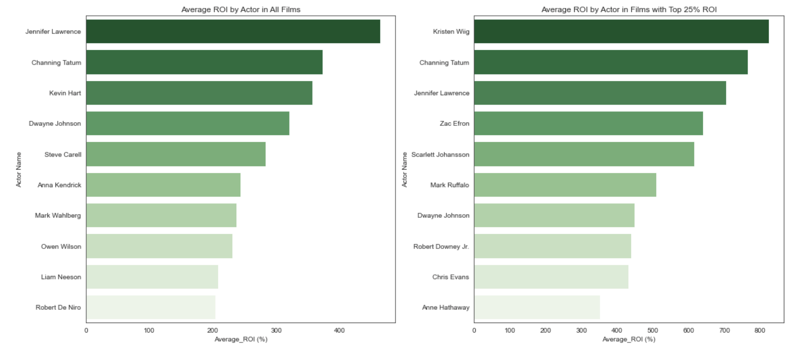
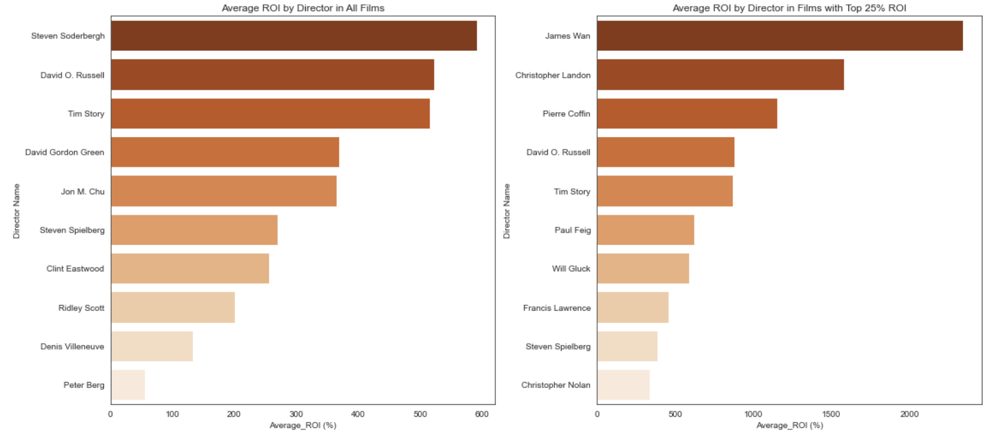
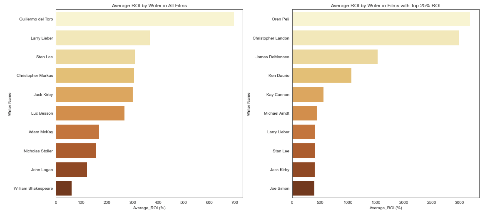
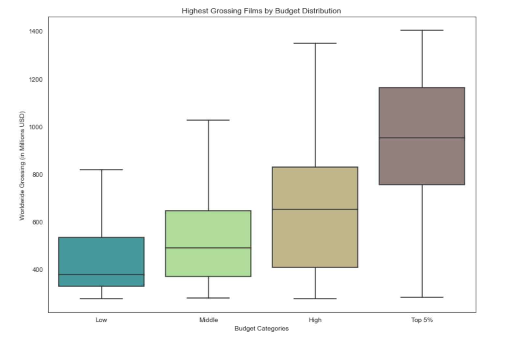
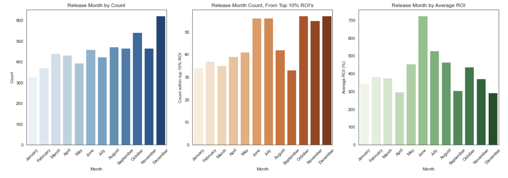
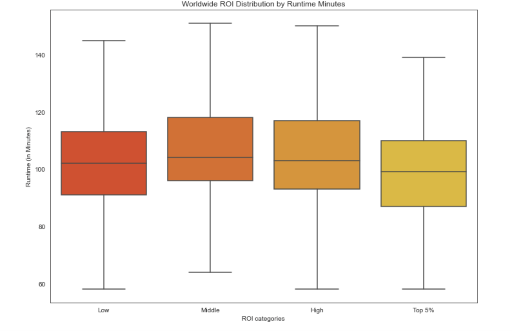
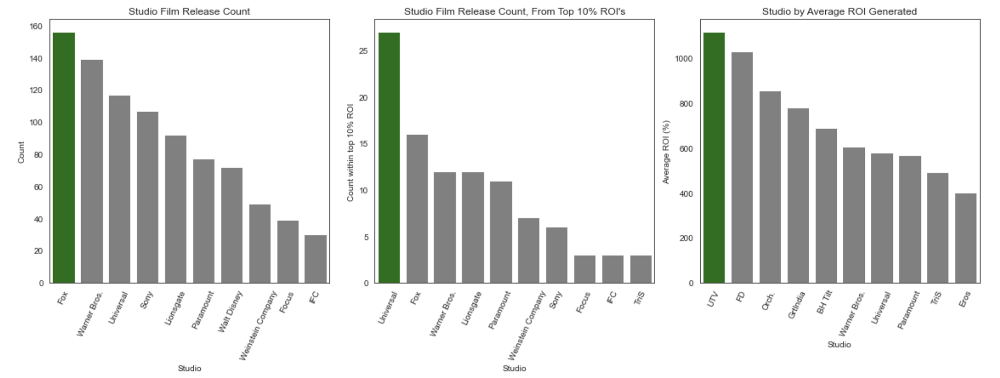

# Microsoft Movie Analysis

**Author**: Hana Kerner

## Overview


Microsoft has shown interest in entering the original video content scene, and would like to create a new movie studio. We have been tasked with investigating current and historical trends within the industry to best advise Microsoft on the best route forward. We have used data from IMb, The Numbers, and Box Office Mojo, while analyzing data from other sources as well. Our methods to parse through data on over 75,000 movies include cleaning, preapring, and presenting the data using descriptive analysis and data modeling. The following analysis will use return on investment (ROI) as the main barometer to the measure success of a film. 

The characteristics and trends that we will be forming recommendations around include: 

- Actors
- Directors
- Writers
- Budget 
- Release Month 
- Runtime 
- Studio
***

## Business Problem

We are looking to create actionable insights for Microsoft pertaining to the attributes of films that will provide the company with the greatest return on investment. 
***
The analysis below aims to answer the following questions:

1. What personnel will generate the greatest return on investment for Microsoft?

Things to consider include:
* Which actors appear most frequently in films with high return? Which directors? Writers?
* Which actors create the highest average return with their films? Directors? Writers?
        
2. What budget is most likely to lead to a high return film?

Things to consider include:
* How does budget relate to worldwide gross?
* Is there a point where return seems to either drop or increase, as budget is increased?

3. What other film attributes have the potential to impact our return?

Things to consider include: 
* How does runtime relate to return? Does this vary much among films?
* How does release month relate to return? Is there a month that is most common for release?
* How does studio relate to return? Does one create superior returns than its counterparts?
***
These questions are crucial in deciding how we will advise Microsoft to move forward, as we will have a better understanding of the industry, and thus, an understanding of what they should focus on to see the greatest possible returns. 
***

## Data

We are working movie datasets from 3 separate sources:

1. [Box Office Mojo](https://www.boxofficemojo.com/): each record represents a film, with attributes of that film (e.g. `domestic_gross`). Studio information will be most useful to us here, helping to answer our third question.


2. [IMDB](https://www.imdb.com/): this database contains multiple tables relating to movie attributes, ratings, and personnel. The `movie_basics`, `principals`, `persons`, `directors`, and `writers` tables will all be useful to us in answering our first question. The `movie_basics` table will also help us answer our third question relating to `runtime_minutes`.


3. [The Numbers](https://www.the-numbers.com/): each record represents a film, with attributes of that film (e.g. `production_budget`). The budget and grossing columns are measured in dollars. The `worldwide_grossing` and `production_budget` attributes will be particularly useful to us in creating our ROI column to measure film success. This dataset will help us answer all of our questions relating to ROI. It will also be useful in answering our second question revolving around the budget, and our third question relating to release month. 

The data above is contained in different formats. The Box Office Mojo data is a compressed CSV (comma-separated-values) file, so below we are able to open it using the `pd.read_csv` function in pandas. We can open The Numbers data using this same method, however, the IMDB is located in a zipped SQLite database. So for that, we unzip, and then query after making the connection to the file using `sqlite3.connect` function in sqlite3. 
***
We also briefly open and look at two other datasets, shown below, but ultimately, the data that these two datasets contain are either repetitive of the data above, or not relevant to our particular analyses. 

[TheMovieDB](https://www.themoviedb.org/)

[Rotten Tomatoes](https://www.rottentomatoes.com/)

***

## Methods

We use descriptive analyis to analyze the data below. 

The process consists of: 
* Importing the libraries and modules
* Accessing and reading each dataframe
* Briefly glancing at each dataset to determine how it pertains to our questions 
* Cleaning the data 
    * Checking and adjusting for null values 
    * Checking and adjusting for duplicates 
    * Changing data types 
    * Cleaning whitespace and unwanted characters
    * Resetting column and table names
    * Dropping uneccessary data and columns
    * Resetting indices where necessary 
    * Creating columns for `ROI` 
    * Creating columns for `release_month`
    * Renaming studio name abbreviations 
    * Joining SQL tables 
    * Merging datasets with `The Numbers`
*** 
#### Preparing Data For Question One:

* Create `full_actor_df` that consists of dataframe of actor names and how many times each appears in all films in the data 
* Create `df_actor_ROI` that consists of a dataframe of actor names and their average ROI
* Create `t25_actor_df`, a dataframe of actor names, and their occurrences in the top 25% of the data sorted by ROI in descending order
* Create `df_top_actors` that consists of a dataframe of the actors from `t25_actor_df`, and their `average_ROI`, calculated by averaging the ROI that their films (in the top 25% of the data sorted by ROI) have generated 
    
Now the data is ready to be viewed in bar plots to look at actor occurrences and actor by the average ROI that they have generated. We repeat the identical process for `directors` and `writers`. Because of the repetitive nature. We defined three functions to expedite the process. 
*** 
#### Preparing Data for Question Two:

* Split our grossing data by looking at the top and bottom 500 values sorted by worldwide gross
* Create budget bins from the top 500 grossing films 
* Use budget as a categorical variable to look even closer at these 500 films 

Since all of our ROI data is dictated by `production_budget`, we will only use our grossing data in our budget evaluation. As a reminder, our ROI formula subtracts budget from gross, and then divides that net profit by budget.
*** 
#### Preparing Data for Question Three: 

1. Runtime Data
    * Fill in missing runtime data with the `median` value of the dataset
    * Create `ROI bins` from the runtime data
    * Use ROI as a categorical variable 
    
2. Release Month
    * Create a dataframe called `full_month_df` that counts the occurences of each month in our data
    * Create a dataframe called `top_months` that counts the occurences of each month in films in the top 10% ROI
    * Create a dataframe called `roi_by_month` that calculates the average ROI in films by month
    
3. Studio data
    * Merge `bom_df` and `df_tn` and clean the new dataframe
    * Create a dataframe called `studio_count_df` that counts the occurences of each studio in our data
    * Create a dataframe called `top_studio` that counts the occurences of each studio in films in the top 10% ROI
    * Create a dataframe called `roi_by_studio` that calculates the average ROI in films by studio
***

## Results

We looked at our models above, by question, and evaluated each question individually to come up with separate recommendations to Microsoft. 

### Question One:

#### Which actors generate the highest ROI? How does that compare to those in films in the top 25% ROI?
***
#### Visual 1


#### Which directors generate the highest ROI? How does that compare to those in films in the top 25% ROI?
***
#### Visual 2


#### Which writers generate the highest ROI? How does that compare to those in films in the top 25% ROI?
***
#### Visual 3


For **actors, directors and writers**, the bar plots helped us look at how often individuals have appeared in films and the making of them over time, and how that compares to the returns they have helped generate. We are making our recommendation based on the personnel with the highest ROI in all films, as well as specifically those films with the top 25% returns. We see there is a lot of overlap here, which makes us even more confident in these recommendations. One thing we will be mindful of, is that a specific actor, director, or writer is not a solve all and should not be the only focus when creating films. That being said, our data and analysis makes it abundantly clear that having high quality actors, directors, and writers is likely to lead to a profitable film and high returns. It is no accident that many of these figures are household names, and no surprise that the numbers further validate their reputations. 

We will be crystal clear in communicating to Microsoft that there will be many other actors, directors, and writers who have the potential to create successful films. That being said, we will recommend Microsoft consider casting **`Kristen Wiig`, `Channing Tatum`, `Dwayne Johnson`, and `Jennifer Lawrence`**. We selected these actors based on their overall and top ROI’s, where we saw a lot of overlap. We will recommend Microsoft considers directors **`Steven Soderbergh`, `James Wan`, `Steven Spielberg`, and `Tim Story`,**, all selected by their ROI. For directors and writers, we focused more on overall average ROI rather than just in the top 25%. We did this because we felt since there was not a lot of overlap, we would be more confident recommending directors and writers to Microsoft who have seen the most returns overtime, inlcuding in their lesser performing films, rather than just looking at their successful moments. With that being said, we will recommend that Microsoft looks to writers **`Guillermo del Toro`, `Oren Peli`, `Larry Lieber`, and `Stan Lee`**, all selected from our ROI calculations. 
***

### Question Two: What is the distribution between `production_budget` , by bin, and `worldwide_gross`?
***
#### Visual 4


For **production budget**, we looked at a scatterplot to see the correlation between budget and worldwide gross. We saw a positive but not incredibly strong relationship there. This helped us decide to narrow down our models a bit, and split the data based on high and low grossing films. We looked at the distribution of the two categories in histograms. Knowing our goal is to help Microsoft bring in as much money as possible, we decided to narrow in on the highest grossing films, searching for any budget patterns in that data. The box and whisker plot helped us look at the budget bins we created, the grossing distribution among those bins. We also looked at this in a bar plot, which was repetitive but helpful to see in another format. Overall, our box and whisker plot helped lead us to our precise budget recommendation.

We saw that by increasing a budget of about 67.5-110 million USD, to 111-160 million the median gross only increases about 100 million. (From 377-490 million). That is not to say this is insignificant, but when looking at returns, you are on average increasing the budget by 100 million and getting 100 million back. The same holds true when you increase the budget from 111 million-160 million, to 168-225 million, the median gross increases from 645-828 million. We saw in our highest budget bins, by increasing the budget from 165-225 million to 230-425 million, the median gross increases from 652 million to 926 million. Again, significant returns, but on a similar scale. 

Finally, increasing the budget from **268-300 million leads to a grossing increase from 953-1,164 million** and **increasing the budget from 300-425 million leads to a grossing increase from 1,164-2,776 million**. These numbers are much more significant. In the last example, we only increase the budget by 125 million, but our gross increases nearly 13 times that at 1,612 million dollars. With this information, we will inform Microsoft that increasing budget in the range of **68-268 million** is likely to see returns on a similar scale, not far from 1:1. However, once you **increase the budget beyond 268 million**, the rate of return may begin to increase dramatically.
***

### Question Three:

#### Which month are the most movies released? Which month within the Top 10% of ROI? Which month generates the highest average ROI?
***
#### Visual 5


For **release month**, the bar plots helped us easily compare the frequency of occurrence and average ROI of each month. Although the overall count of occurrences is important, we saw that December was the most common release month, but was low when it came to generating ROI. However, when it came to looking only at occurrences of films that were in the top 10% of returns, June sneaks in there, as well as July, October, and December. Once we took it one step further, only looking at average ROI per month, **June came out on top**. **This is the month that we will recommend to Microsoft**, seeing as our measure of success is ROI, and on average, releasing a film in June has historically seen over a 700% return on average. We want to equip Microsoft with as thorough and comprehensive of a recommendation as possible. Because of this we will mention that after June, we recommend releasing films in **July, October, and December**, in respective order.

#### How is the runtime data distributed? How does this data relate to ROI?
*** 
#### Visual 6


For **runtime**, the histogram and scatterplot were helpful, but only looked at the runtime data on its own. These plots helped us decide to bin our ROI data to get a better look at how runtime spread among different categories of return for films. **We will recommend the range of runtime minutes** from the 50%-75% percentiles of the Top 5% of our data. This is the **range of 99-110 minutes**. We will advise Microsoft **not dip below 99 minutes**, and if anything **let runtime run up until 118 minutes**, but not above that point. 118 minutes is the longest runtime that we see at the 75% runtime mark of our bins. By doing this, we are also including the runtime metrics that we see in 50% of all other bins of our data, so we can be confident that these runtimes have historically and will continue to lead to high returns on films. 

#### Which studio has released the most films? Which within the Top 10% of ROI? Which studio generates the highest average ROI?
*** 
#### Visual 7


For **studio**, we saw that when we looked at average ROI, instead of studio counts, our recommendation would change significantly. Looking closer at studios with the highest average ROI, we saw many of them are international studios. Emulating the practices of international studios may not provide Microsoft with the best environment to be successful domestically. For instance, UTV is known as Walt Disney Studio Films in India. Earlier, we grouped many of the obvious studio labels together, but also did not want to skew the data grouping labels that may have been less appropriate. Now we know that:

* `the Orchard` is a subsidiary of `Sony`, and `Tristar Pictures` is a member of the `Sony Motion Picture Group`. 
* `GrtIndia` only has one film in our data, with a sample size of one, this is not a studio we would recommend to Microsoft. 
* `BH Tilt`, known as Blumhouse Production, has produced Paranormal Activity, Insidious, The Purge, etc. This is a production company specializing in a particular genre (Haunted), so again, we would be mindful recommending this to Microsoft. 
* `Eros` is an Indian motion picture production and distribution company, they have generated a very high return over time, but again, we would be mindful advising Microsoft to use international studios. 

Because of this analysis, our studio recommendation focuses on the overlap of studios in our studio count by top 10% ROI and the average ROI of those studios in our plots. This leaves us recommending Microsoft look to studios, studio members, and studio subsidiaries of **Universal, Warner Brothers, Paramount, and Sony.** 
***

## Conclusions

Now that we have evaluated all the data, we can list out our actionable recommendations. We will be able to provide Microsoft with these recommendations, advising the company with how best to proceed with its venture into the video content industry.
*** 

Our first question involved us analyzing actors, directors, and writers. We recommend:
* Considering casting **Kristen Wiig, Channing Tatum, Dwayne Johnson, and Jennifer Lawrence**
* Considering directors **Steven Soderbergh, James Wan, Steven Spielberg, and Tim Story**
* Considering writers **Guillermo del Toro, Oren Peli, Larry Lieber, and Stan Lee**

***

Our second question involved us exploring production budget values that have been historically successful. We recommend:
* Keeping the budget in the range of **68-268 million USD**
* **OR** increasing the budget above **268 million USD**

***

Our third question aimed to see how other characteristics of movies may lead to a higher return on investment. We recommend: 
* Releasing films in **June**, followed by **July, October, and December**
* Limiting films to a runtime of **99-110 minutes**, **no shorter than 99 minutes and no longer than 118 minutes**
* Emulating **Universal, Warner Brothers, Paramount, and Sony** studios

***
#### Things to consider and next steps:
* A lot of this data is historical, how can we get a more current view of the film landscape?
* How has the film landscape changed as streaming has taken off?
* How has production budget changed over time? How does this impact our evaluation using ROI? 
* What can we learn from looking at studio producing films that have performed poorly?
* Our analysis does not take in the factor of time, since we are using ROI. How can we better include this?
* How may difference personnel impact budget? How may they impact onset culture? Can this be quantified?
* How does genre impact ROI?

***

## For More Information

Please review our full analysis in [our Jupyter Notebook](./dsc-phase1-project-template.ipynb) or our [presentation](./presentation.pdf).

For any additional questions, please contact **Hana Kerner & haych20@gmail.com**

## Repository Structure

Describe the structure of your repository and its contents, for example:

```
├── README.md                           <- The top-level README for reviewers of this project
├── dsc-phase1-project-template.ipynb   <- Narrative documentation of analysis in Jupyter notebook
├── presentation.pdf         <- PDF version of project presentation
├── data                                <- Both sourced externally and generated from code
└── images                              <- Both sourced externally and generated from code
```

